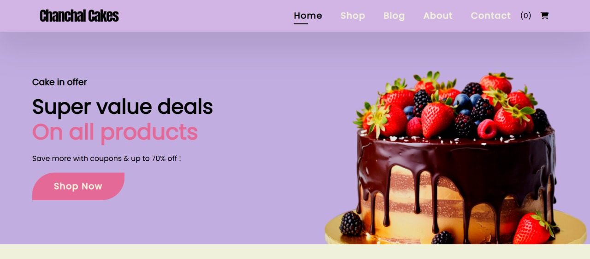
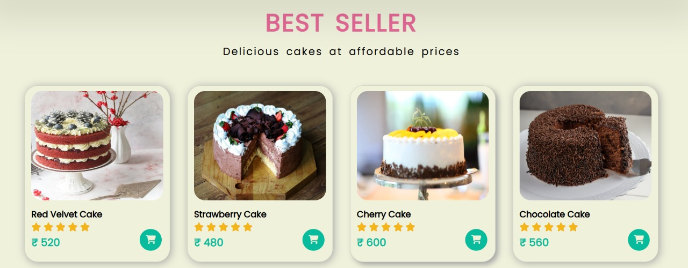
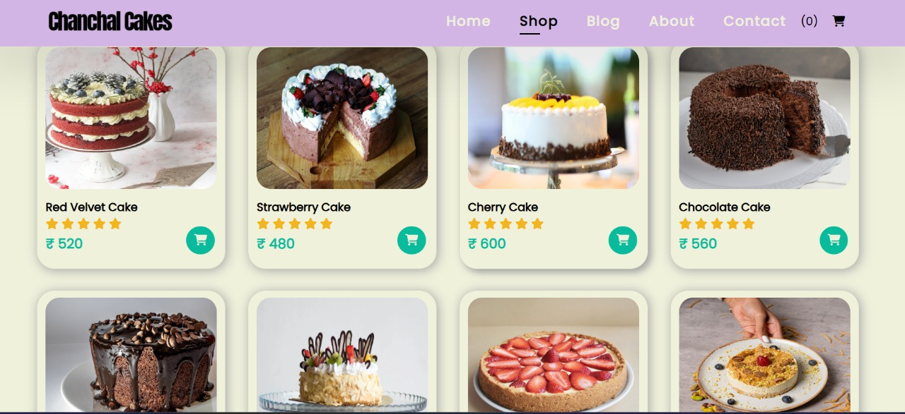
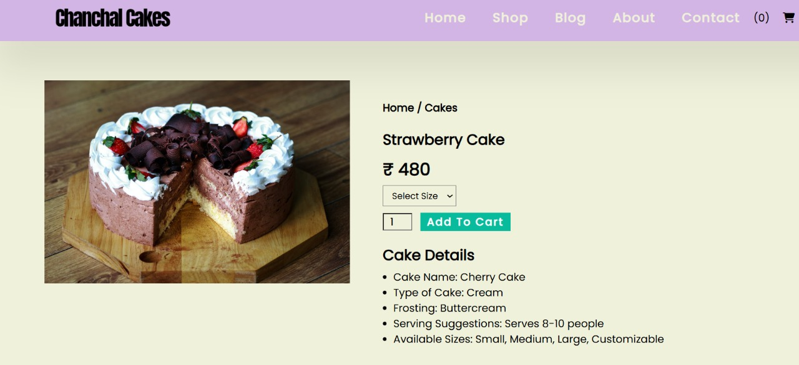
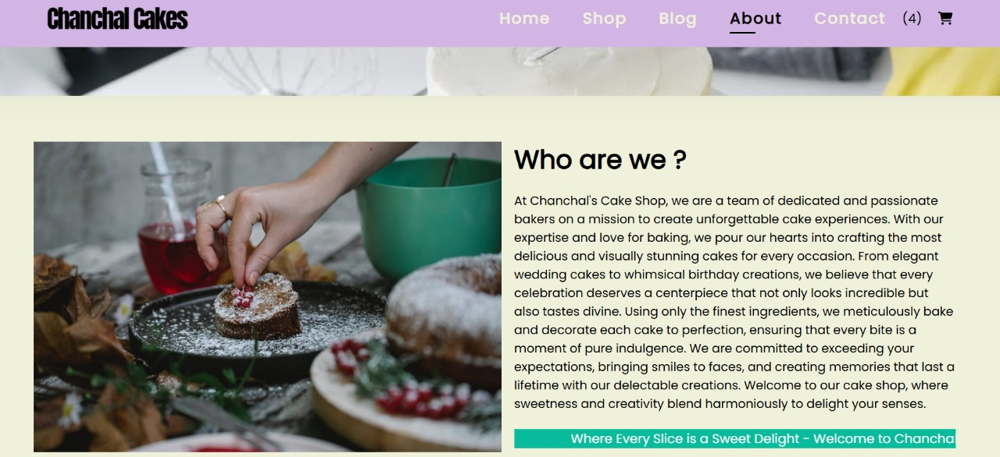
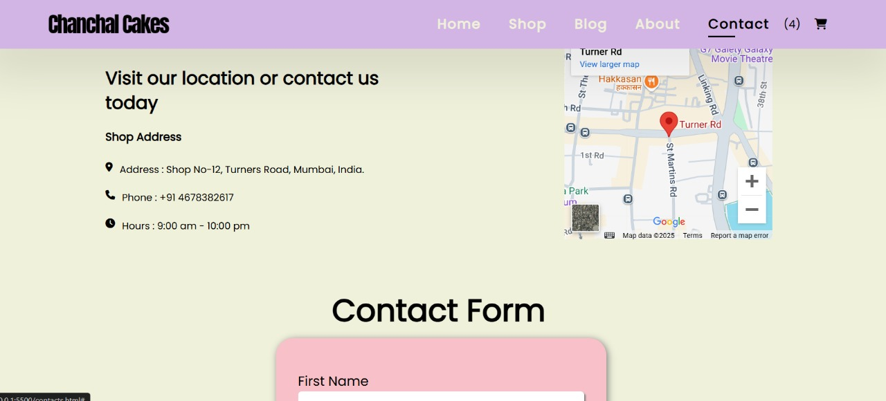

# Chanchal Cake Shop 🍰

Welcome to the **Chanchal Cake Shop** project! This is a frontend web application designed for showcasing cakes, managing shopping carts, and providing users with a delightful browsing experience. Explore our cakes, read engaging blogs, and get in touch via the contact form.

---

## 🌟 Features
1. **Home Page**  
   - Displays a variety of cakes along with their prices.  
   - Visually engaging sections to captivate users at first glance.  

2. **Shop Page**  
   - Browse cakes and select your favorites.  
   - Add selected cakes to the shopping cart for a seamless experience.  

3. **Blog Page**  
   - Features engaging blogs about cakes, baking tips, and more.  

4. **Contact Page**  
   - Displays the shop's address and a contact form.  
   - Users can send a message through the form and receive an email confirmation.

---

## 📸 Screenshots

### Home Page (Part 1)  
  

### Home Page (Full View)  
  
  

### Shop Page  
  

### Blog Page  
  

### Contact Page  
  

---
## 🛠️ Tech Stack
- **HTML5**: Markup structure of the website.  
- **CSS3**: Styling and design for a polished UI.  
- **JavaScript**: For interactivity and dynamic functionality.  

---

## 🚀 Getting Started

### Prerequisites
- A browser (e.g., Google Chrome, Firefox).  
- Basic knowledge of HTML/CSS/JavaScript to explore the project.  

### Installation
1. Clone this repository:  
   ```bash
   git clone https://github.com/your-username/chanchal-cake-shop.git
